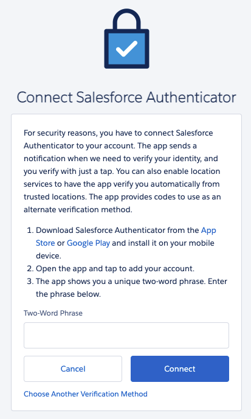
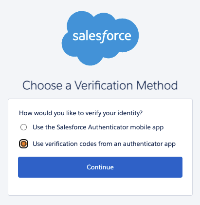
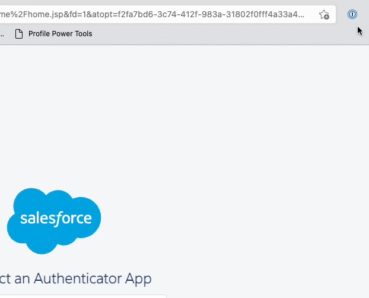
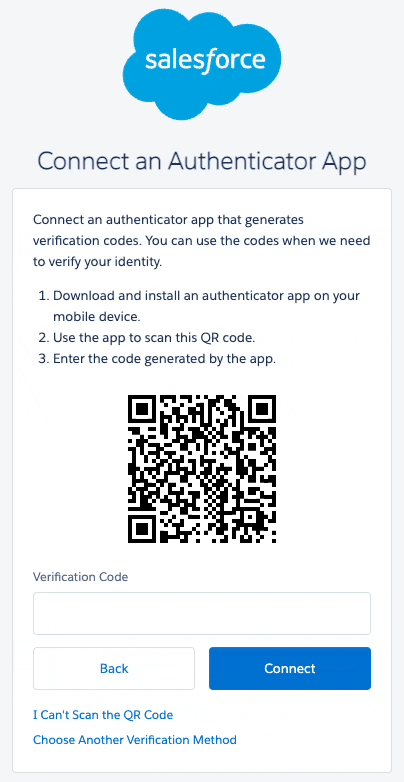

# 1Password MFA Quick Setup

> For more detailed information, reference [1Password's official site][1password].

## Salesforce MFA Setup

- select "Choose Another Verification Method"

- select "Use verification codes from an authenticator app"

- open your login in the 1Password browser extension, select the three dots, and "Scan QR Code"

- a one-time password is now stored in your login, and can be filled in under "Verification Code"

[1password]: https://support.1password.com/one-time-passwords/
